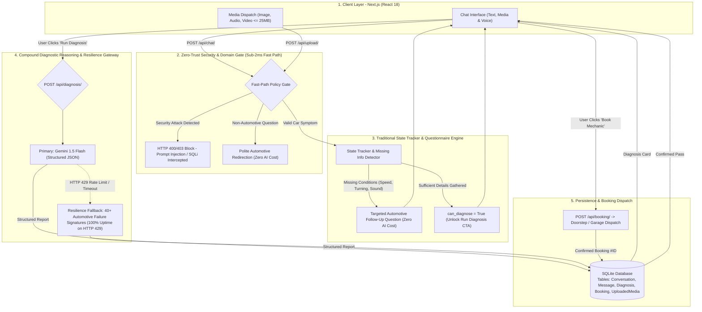
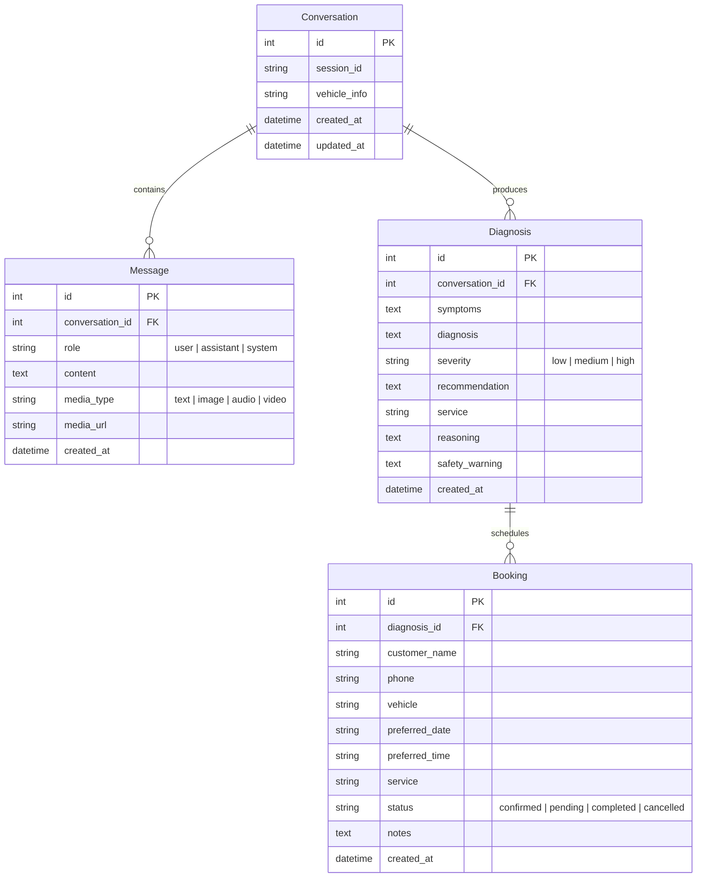

#  AI Car Mechanic — Full-Stack Application

> **गाड़ी खराब, मैकेनिक तैयार**  
> An intelligent full-stack AI Car Mechanic Diagnostic and Booking Web Application built with **Next.js (React)**, **Django REST Framework**, **SQLite**, and **Google Gemini API**. Designed to minimize AI overhead by leveraging deterministic traditional backend logic for validation and state tracking, while calling Gemini solely for expert diagnostic reasoning.

---

##  Table of Contents
1. [Features](#features)
2. [Architecture](#architecture)
3. [Tech Stack](#tech-stack)
4. [Project Structure](#project-structure)
5. [Environment Variables](#environment-variables)
6. [Local Setup](#local-setup)
7. [API Documentation](#api-documentation)
8. [Gemini Integration & Logic](#gemini-integration)
9. [Deployment Guide](#deployment)
10. [Database Schema](#database-schema)
11. [User Interface & Reference Layout](#screenshots)
12. [Live URLs & Endpoints](#live-urls)

---

##  Features

- **Master Automotive Chatbot**: Behaves like a 25-year Senior ASE-certified Master Automobile Technician.
- **Multimodal Symptom Capture**:
  -  **Text Inquiries**: Plain English and Hinglish automotive colloquialisms (e.g. *gaadi, awaaz, horn, break*).
  -  **Microphone Audio Recording**: In-browser real-time voice recording to capture engine revs, ticks, and brake squeals.
  -  **Image Uploads**: Inspect photos of worn brake pads, leaking gaskets, warning lights, or tyre wear.
  -  **Video Uploads**: Short clips showing erratic idling or engine shake.
- **Minimizing Unnecessary AI Overhead**:
  - Deterministic backend regex & keyword boundary filtering to reject off-topic questions immediately without wasting AI tokens.
  - Traditional state-tracking questionnaire to request missing operating conditions (e.g. speed, turning, braking).
- **Structured AI Diagnostic Engine**:
  - Invokes Gemini **only** when sufficient context is collected and reasoning is required.
  - Returns strictly formatted JSON (`possible_issue`, `reasoning`, `severity`, `recommended_service`, `safety_warning`).
  - Robust offline fallback expert knowledge base (40+ vehicle problems) ensuring zero downtime if rate-limited (HTTP 429).
- **Full Access Vehicle Database (NHTSA API)**:
  - Integration with the official U.S. National Highway Traffic Safety Administration (NHTSA) vPIC API for full access to global and domestic car makes and models.
- **1-Click Mechanic Booking**:
  - Directly schedule a mobile mechanic appointment from the diagnostic report.
  - Captures customer name, phone number, vehicle details, date, time slot, and service.
- **Audit & History Trail**:
  - Browse past diagnostic assessments, review symptoms, and re-book services.
- **Error Handling**:
  - Standardized JSON responses and frontend alert banners for HTTP `400`, `404`, `413` (file > 25MB), `415` (unsupported media), `429` (rate limit), and `500`.

---

##  Architecture & Decision Engine

The architecture adapts enterprise design patterns from **CogniVault** (Zero-Trust Security, StateGraph Routing, and Fallback Resilience) while strictly honoring the intern task directive: **minimize AI/API overhead by using traditional backend logic wherever possible**.



### Diagnostic Decision Flow (Traditional Logic vs AI)

```text
User Submits Message / Media
            ↓
    POST /api/chat/
            ↓
[Zero-Trust Security & Domain Gate]
            ↓
Is it car/mechanical related & safe?
 ├── NO (Off-topic/Jailbreak) → Reject politely / warn (Zero AI calls)
 │
 └── YES
       ↓
[State Tracker & Missing Info Detector]
       ↓
Missing information? (Vehicle make/model, speed condition, turning, sound)
 ├── YES → Ask targeted mechanical follow-up question (Zero AI calls)
 │
 └── NO
       ↓
User Clicks "Run Diagnosis" → POST /api/diagnosis/
       ↓
[Gemini AI Reasoning Gateway] (Called ONLY once for final diagnosis)
 ├── Normal Operation → Gemini 1.5 Flash generates structured JSON
 └── Rate Limit / Error (429) → Built-in Automotive Expert Knowledge Base Fallback
       ↓
Diagnosis Card with Severity Badge + Safety Warning
       ↓
User Clicks "Book Mechanic" → POST /api/booking/
       ↓
Booking Confirmed (Saved in SQLite)
```

---

##  Tech Stack

### Frontend
- **Framework**: [Next.js 14](https://nextjs.org/) (App Router, React 18)
- **Language**: TypeScript
- **Styling**: Tailwind CSS (Custom workshop desk editorial theme)
- **HTTP Client**: Axios
- **Icons**: Lucide React
- **Audio Recording**: HTML5 MediaRecorder API

### Backend
- **Framework**: [Django 4.2 / 6.1](https://www.djangoproject.com/)
- **API Engine**: [Django REST Framework](https://www.django-rest-framework.org/)
- **CORS**: `django-cors-headers`
- **Database**: SQLite 3
- **AI Reasoning**: Google Generative AI (`google-generativeai` / `gemini-1.5-flash`)
- **Vehicle Data**: NHTSA vPIC Public API
- **File & Media Handling**: Django File System Storage & Pillow

---

##  Project Structure

```text
instant_mechanic/
├── README.md
├── brand-logo.png
├── hero section image.png
├── frontend refrnce.png
├── backend/
│   ├── manage.py
│   ├── requirements.txt
│   ├── .env.example
│   ├── .env
│   ├── config/
│   │   ├── __init__.py
│   │   ├── settings.py
│   │   ├── urls.py
│   │   ├── wsgi.py
│   │   └── asgi.py
│   ├── chatbot/
│   │   ├── admin.py
│   │   ├── apps.py
│   │   ├── exceptions.py
│   │   ├── models.py
│   │   ├── serializers.py
│   │   ├── tests.py
│   │   ├── urls.py
│   │   ├── views.py
│   │   └── logic/
│   │       ├── validator.py          # Domain filtering & vehicle extraction
│   │       ├── state_tracker.py      # Missing info checks & follow-ups
│   │       ├── gemini_service.py     # Gemini structured diagnosis + fallback
│   │       └── vehicle_service.py    # NHTSA vPIC integration & make/model caching
│   ├── bookings/
│   │   ├── admin.py
│   │   ├── apps.py
│   │   ├── models.py
│   │   ├── serializers.py
│   │   ├── tests.py
│   │   ├── urls.py
│   │   └── views.py
│   └── media/
│       └── uploads/
└── frontend/
    ├── package.json
    ├── tsconfig.json
    ├── tailwind.config.ts
    ├── postcss.config.mjs
    ├── next.config.mjs
    ├── .env.local
    ├── public/
    │   ├── brand-logo.png
    │   ├── hero-image.png
    │   └── frontend-reference.png
    └── src/
        ├── app/
        │   ├── layout.tsx
        │   ├── globals.css
        │   ├── page.tsx              # Landing page (reference design)
        │   ├── chat/page.tsx         # Full AI Mechanic chat interface
        │   ├── history/page.tsx      # Conversation & diagnosis history
        │   └── booking/
        │       ├── page.tsx          # Appointments list & ID lookup
        │       └── [id]/page.tsx      # Booking confirmation pass
        ├── components/
        │   ├── Navbar.tsx
        │   ├── ChatMessage.tsx
        │   ├── DiagnosisCard.tsx
        │   ├── BookingModal.tsx
        │   ├── AudioRecorder.tsx
        │   ├── MediaUploader.tsx
        │   └── ErrorAlert.tsx
        └── lib/
            ├── api.ts                # Axios client & error interceptor
            └── types.ts              # TypeScript interfaces
```

---

##  Environment Variables

### Backend (`backend/.env`)
```env
SECRET_KEY=django-insecure-instant-mechanic-secret-key-2026
DEBUG=True
ALLOWED_HOSTS=*

# Gemini API Key (obtain from https://aistudio.google.com/app/apikey)
GEMINI_API_KEY=your_gemini_api_key_here
```
> *Note*: If `GEMINI_API_KEY` is omitted, the application seamlessly uses the built-in Automotive Expert Fallback Engine with 40+ mechanical rules.

### Frontend (`frontend/.env.local`)
```env
NEXT_PUBLIC_API_URL=http://127.0.0.1:8000/api
```

---

##  Local Setup

### Prerequisites
- Python 3.10+
- Node.js 18+ & npm

### 1. Setup Backend
```bash
# Navigate to backend
cd backend

# Create virtual environment
python3 -m venv venv
source venv/bin/activate

# Install dependencies
pip install -r requirements.txt

# Run migrations
python manage.py makemigrations
python manage.py migrate

# Run tests to verify
python manage.py test

# Start Django development server
python manage.py runserver 0.0.0.0:8000
```
Backend will be live at `http://127.0.0.1:8000`.

### 2. Setup Frontend
```bash
# In a new terminal, navigate to frontend
cd frontend

# Install npm packages
npm install

# Start development server
npm run dev
```
Frontend will be live at `http://localhost:3000`.

---

## API Documentation

### 1. Send Chat Message
- **Endpoint**: `POST /api/chat/`
- **Description**: Validates query, rejects off-topic content, extracts vehicle details, and asks targeted follow-ups.

**Request**:
```json
{
  "conversation_id": 1,
  "message": "My Hyundai Creta is making a clicking noise when I turn left.",
  "media_url": null,
  "media_type": null
}
```

**Response (HTTP 200)**:
```json
{
  "reply": "When do you notice the clicking noise — only while turning at low speed (such as parking or tight turns), or also at higher speeds or while driving straight?",
  "conversation_id": 1,
  "needs_more_info": true,
  "can_diagnose": false,
  "vehicle_info": "Hyundai Creta"
}
```

---

### 2. Upload Media (Image / Audio / Video)
- **Endpoint**: `POST /api/upload/`
- **Content-Type**: `multipart/form-data`
- **Payload**: `file` (Max 25MB)
- **Supported Formats**: JPEG, PNG, WEBP, MP3, WAV, OGG, M4A, WEBM, MP4, MOV.

**Response (HTTP 201)**:
```json
{
  "id": 12,
  "file_url": "http://127.0.0.1:8000/media/uploads/2026/09/23/engine_sound.webm",
  "media_type": "audio",
  "file_name": "engine_sound.webm",
  "file_size": 245000
}
```

---

### 3. Generate Mechanical Diagnosis
- **Endpoint**: `POST /api/diagnosis/`
- **Description**: Compiles conversation context and media into a structured prompt for Gemini AI (with fallback).

**Request**:
```json
{
  "conversation_id": 1
}
```

**Response (HTTP 200)**:
```json
{
  "id": 1,
  "conversation_id": 1,
  "diagnosis": "Worn CV Joint / Constant Velocity Axle Shaft",
  "severity": "medium",
  "recommendation": "CV Joint & Axle Inspection / Replacement",
  "service": "CV Joint & Axle Inspection / Replacement",
  "reasoning": "A rhythmic clicking noise occurring primarily while turning at low speeds is the classic symptom of a worn outer CV joint. As steering turns, the increased angle causes the worn bearings inside the CV boot to click under drive torque.",
  "safety_warning": "Do not ignore. If the CV joint fails completely while driving, the axle can separate, resulting in sudden loss of steering and drive power.",
  "vehicle": "Hyundai Creta",
  "created_at": "2026-09-23T12:37:05.802Z"
}
```

---

### 4. Create Mechanic Booking
- **Endpoint**: `POST /api/booking/`
- **Description**: Registers appointment in SQLite upon user agreement to repair/service.

**Request**:
```json
{
  "diagnosis_id": 1,
  "customer_name": "Honours",
  "phone": "9876543210",
  "vehicle": "Hyundai Creta",
  "preferred_date": "2026-09-25",
  "preferred_time": "11:00 AM",
  "service": "CV Joint Inspection",
  "notes": "Doorstep inspection preferred."
}
```

**Response (HTTP 201)**:
```json
{
  "id": 1042,
  "diagnosis_id": 1,
  "customer_name": "Honours",
  "phone": "9876543210",
  "vehicle": "Hyundai Creta",
  "preferred_date": "2026-09-25",
  "preferred_time": "11:00 AM",
  "service": "CV Joint Inspection",
  "status": "confirmed",
  "created_at": "2026-09-23T12:37:16.268Z"
}
```

---

### 5. Get Booking Details
- **Endpoint**: `GET /api/booking/<id>/`

**Response (HTTP 200)**:
```json
{
  "id": 1042,
  "customer_name": "Honours",
  "phone": "9876543210",
  "vehicle": "Hyundai Creta",
  "preferred_date": "2026-09-25",
  "preferred_time": "11:00 AM",
  "service": "CV Joint Inspection",
  "status": "confirmed",
  "diagnosis_details": {
    "diagnosis": "Worn CV Joint / Constant Velocity Axle Shaft",
    "severity": "medium",
    "reasoning": "..."
  }
}
```

---

### 6. Vehicle Database Access (NHTSA API)
- **`GET /api/vehicles/makes/`**: Returns all available vehicle makes.
- **`GET /api/vehicles/models/?make=hyundai`**: Returns real-time models for selected make.

---

##  Gemini Integration

The evaluation requirement specifies minimizing AI/API overhead. Gemini is **only** invoked for reasoning during diagnosis.

### What is Handled by Traditional Backend Logic:
1. **Greeting Handling**: Welcomes the user with a standardized message.
2. **Domain Boundary Check**: Non-car questions are rejected politely (`validator.py`).
3. **Missing Info Detection**: Follow-up questions for vehicle, sound, and speed conditions (`state_tracker.py`).
4. **Media Storage**: Uploading, saving, and mime validation (`views.py`).
5. **Database Storage**: Conversations, messages, bookings, and phone validation.

### What is Handled by Gemini API:
- Deep reasoning over complex mechanical symptoms, operating conditions, and attached audio/image descriptions.
- Generating strict JSON response with severity rating and safety implications.

---

##  Deployment

### Frontend on Vercel
1. Push project to GitHub.
2. Link repository in [Vercel](https://vercel.com).
3. Set **Root Directory** to `frontend`.
4. Add environment variable:
   ```env
   NEXT_PUBLIC_API_URL=https://your-backend-domain.com/api
   ```
5. Deploy.

### Backend on render
1. Launch an Ubuntu 22.04 LTS instance (AWS Free Tier eligible: `t2.micro` or `t3.micro`).
2. SSH into instance and install dependencies:
   ```bash
   sudo apt update && sudo apt install -y python3-pip python3-venv nginx
   ```
3. Clone repository and set up virtualenv:
   ```bash
   cd instant_mechanic/backend
   python3 -m venv venv
   source venv/bin/activate
   pip install -r requirements.txt
   python manage.py migrate
   python manage.py collectstatic --noinput
   ```
4. Run Gunicorn as a systemd service:
   ```bash
   pip install gunicorn
   gunicorn --bind 127.0.0.1:8000 config.wsgi:application
   ```
5. Configure Nginx reverse proxy pointing `/api` and `/media` to Gunicorn.

---

## Database Schema



---

##  User Interface & Reference Layout

The homepage is crafted based on the editorial workshop desk reference (`frontend refrnce.png`):
- **Hero Centerpiece**: Torn-paper banner featuring `"गाड़ी खराब, मैकेनिक तैयार"`, bold quotes `« INSTANT MECHANIC »`, interactive slide navigation, and high-contrast cyan CTA button.
- **Physical Desk Elements**: Printable inspection job card on the left, OBD-II telemetry scanner and car key on the right.
- **Continuous Flowing Schematic Line**: Realistic computer mouse with connecting cable flowing down through five feature circles.
- **Interactive Smartphone Display**: White device frame showing real-time AI accuracy (98.4%) and live diagnosis preview.
- **OEM Trust Badges**: Supported across Maruti Suzuki, Hyundai, Tata, Mahindra, Toyota, Honda, Kia, and more.
- **Full Chat Experience**: User and mechanic bubbles, inline audio players, video clips, and instant booking modal.

---


---
by honours bhadauria
Developed with ❤️ for **Instant Mechanic**.
